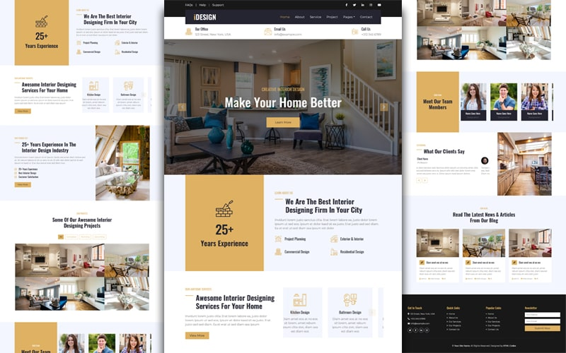

# iDesign Interior Decorator Website

Welcome to the iDesign Interior Decorator website! This project is a responsive, user-friendly website designed to showcase interior decorating services.
It includes several key sections: Home, About, Services, Projects, and Contact.  
The website is built using HTML, CSS, JavaScript, and Bootstrap to ensure a modern and visually appealing design.
()
# Demo
Check out the live demo of the iDesign Interior Decorator website:[ [Live Demo Link]](https://hadiqaaziz.github.io/iDesign/)

# Features
- Responsive Design:  Optimized for desktop, tablet, and mobile devices.
- Modern Aesthetics: Clean and contemporary design using Bootstrap.
- Interactive Elements: Smooth scrolling, hover effects, and form validation.
- Project Showcase: Gallery of completed projects with descriptions and images.
- Contact Form: Easy-to-use form for potential clients to get in touch.
# Technologies
- HTML5: Structure of the website.
- CSS3: Styling and layout of the website.
- JavaScript: Interactive elements and functionality.
- Bootstrap: Responsive design and pre-built components.
# Setup
To set up the project locally, follow these steps:

# Clone the repository:
- Copy code:  git clone https://github.com/yourusername/idesign.git 
- Navigate to the project directory: cd idesign 
- Open index.html in your preferred web browser. 
# Usage
- Open index.html in a web browser to view the website. 
- Modify the HTML, CSS, and JavaScript files as needed to customize the content and design. 
# Pages
# Home
- Purpose: Welcome visitors and provide an overview of services. 
- Features: Hero section, introductory text, and a call-to-action button.
# About
- Purpose: Introduce the company and team.
- Features: Company history, mission statement, and team member profiles.
# Services
- Purpose: Outline the services offered.
- Features: List of services with descriptions and icons.
# Projects
- Purpose: Showcase completed projects.
- Features: Image gallery with project descriptions and links to detailed views.
# Contact
- Purpose: Provide a way for potential clients to get in touch.
- Features: Contact form with validation and social media links.
